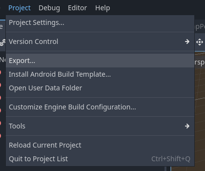
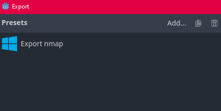
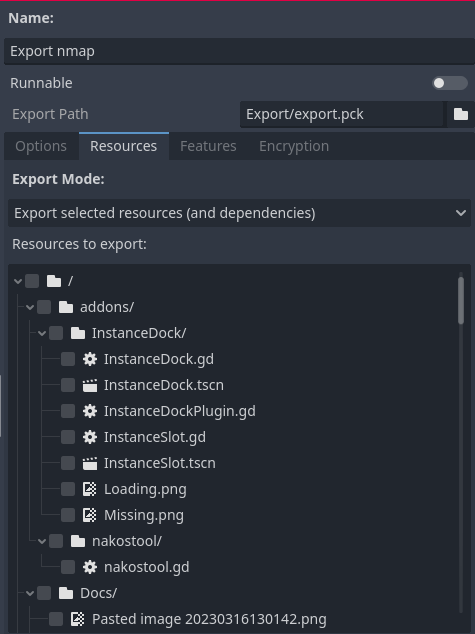
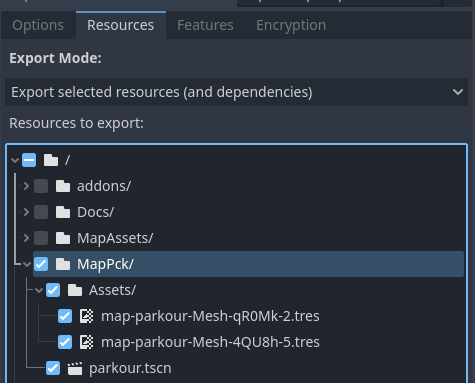
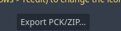

Creating a map is quite an easy process however you must pay extra attention when exporting the map.  

To begin creating a map, create a 3D scene in the root of the creator kit project in godot.  
There will be some pre-made assets in the MapAssets folder and the prefabs menu will have some prefabs you can drag into your scene.  

**Do not add scripts to your map or any of its resources as the game will refuse to load your map**  

## Exporting
To export your map, there are a couple of steps

First, open your main map scene in godot and make sure it is the currently open scene.  
Then go to the CreatorTools menu and press Build map  
This will create a copy of your map with all instantiated scenes "un-instantiated" so that the whole map is in a single scene file.  
It will also make a folder with all assets your map depends on, with prefixed names to avoid incompatibilities with other maps.  

> Note that this may be buggy and may not work with very complex scenes and resource  

Now you need to open Godot's export menu

Select "Export"  
You will get this window  

  

Click on the windows export option then navigate to the resources tab  

  

Then tick ONLY the MapPck folder  

  

Press Export PCK/Zip  

  

Export your map as a zip file with the same name as your main map scene. e.g. for a map called parkour export as parkour.tscn  

In file explorer, change the extension of the export file from .zip to .nmap  
Aaand you're done!