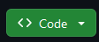

Here is a step by step guide to setting up the devkit

1. [Download the devkit](https://github.com/chunkymonkeygames/CreatorKit) from github by clicking the code button, then pressing download zip
   
2. Unzip it and extract it somewhere safe, e.g. your Documents folder
3. Open it in [Godot 4.0](https://github.com/godotengine/godot/releases/tag/4.0-stable) (do not use 4.1 or any later version. 4.0 only)

## What's next
* [Make a map](./Map/create)